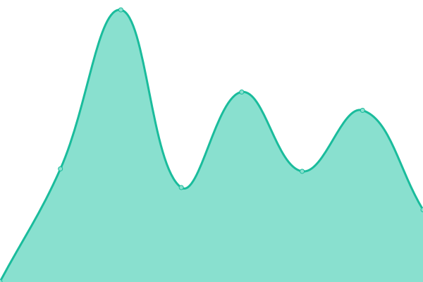
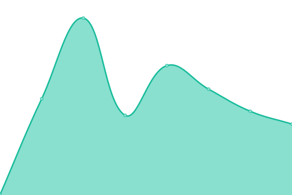

# [📈 Live Status](https://benharri.github.io/upptime): <!--live status--> **🟩 All systems operational**

This repository contains the open-source uptime monitor and status page for [Ben Harris](https://benharri.org/), powered by [Upptime](https://github.com/upptime/upptime).

With [Upptime](https://upptime.js.org), you can get your own unlimited and free uptime monitor and status page, powered entirely by a GitHub repository. We use [Issues](https://github.com/benharri/upptime/issues) as incident reports, [Actions](https://github.com/benharri/upptime/actions) as uptime monitors, and [Pages](https://benharri.github.io/upptime) for the status page.

<!--start: status pages-->
<!-- This summary is generated by Upptime (https://github.com/upptime/upptime) -->
<!-- Do not edit this manually, your changes will be overwritten -->
<!-- prettier-ignore -->
| URL | Status | History | Response Time | Uptime |
| --- | ------ | ------- | ------------- | ------ |
|  [tilde.team](https://tilde.team) | 🟩 Up | [tilde-team.yml](https://github.com/benharri/upptime/commits/HEAD/history/tilde-team.yml) | 

 419ms
     
 | 

<a href="https://benharri.github.io/upptime/history/tilde-team">100.00%</a>
    

|  [tildegit](https://tildegit.org) | 🟩 Up | [tildegit.yml](https://github.com/benharri/upptime/commits/HEAD/history/tildegit.yml) | 

 315ms
     
 | 

<a href="https://benharri.github.io/upptime/history/tildegit">100.00%</a>
    

|  [tilde news](https://tilde.news) | 🟩 Up | [tilde-news.yml](https://github.com/benharri/upptime/commits/HEAD/history/tilde-news.yml) | 

 376ms
     
 | 

<a href="https://benharri.github.io/upptime/history/tilde-news">100.00%</a>
    

|  [tilde chat](https://tilde.chat) | 🟩 Up | [tilde-chat.yml](https://github.com/benharri/upptime/commits/HEAD/history/tilde-chat.yml) | 

 228ms
     
 | 

<a href="https://benharri.github.io/upptime/history/tilde-chat">100.00%</a>
    

|  [homepage](https://benharri.org) | 🟩 Up | [homepage.yml](https://github.com/benharri/upptime/commits/HEAD/history/homepage.yml) | 

 513ms
     
 | 

<a href="https://benharri.github.io/upptime/history/homepage">100.00%</a>
    

|  [bsd.tilde.team](https://bsd.tilde.team) | 🟩 Up | [bsd-tilde-team.yml](https://github.com/benharri/upptime/commits/HEAD/history/bsd-tilde-team.yml) | 

 418ms
     
 | 

<a href="https://benharri.github.io/upptime/history/bsd-tilde-team">99.27%</a>
    

|  [mastodon](https://tilde.zone) | 🟩 Up | [mastodon.yml](https://github.com/benharri/upptime/commits/HEAD/history/mastodon.yml) | 

 549ms
     
 | 

<a href="https://benharri.github.io/upptime/history/mastodon">98.95%</a>
    

|  [tcpinball](https://tcpinball.org) | 🟩 Up | [tcpinball.yml](https://github.com/benharri/upptime/commits/HEAD/history/tcpinball.yml) | 

 461ms
     
 | 

<a href="https://benharri.github.io/upptime/history/tcpinball">100.00%</a>
    

<!--end: status pages-->

[**Visit our status website →**](https://benharri.github.io/upptime)

## 📄 License

- Powered by: [Upptime](https://github.com/upptime/upptime)
- Code: [MIT](./LICENSE) © [Ben Harris](https://benharr.is/)
- Data in the `./history` directory: [Open Database License](https://opendatacommons.org/licenses/odbl/1-0/)
